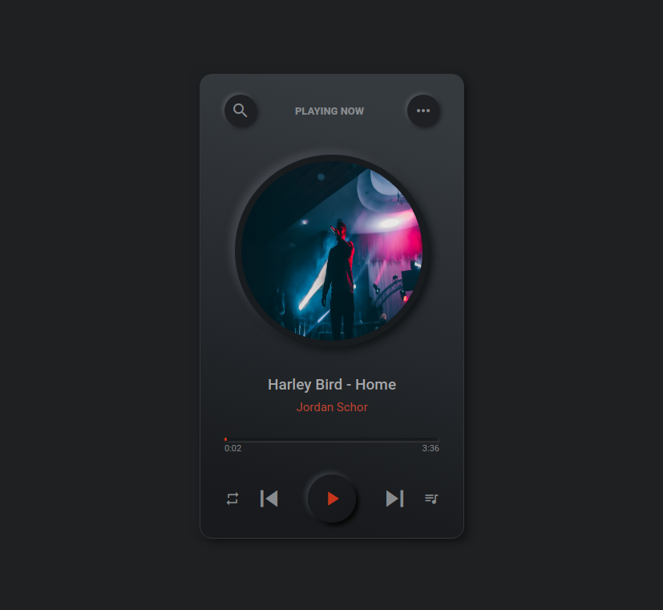
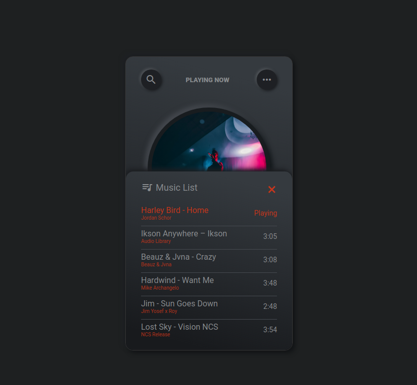

# MP3 Player

A simple MP3 Player built using HTML, CSS and JavaScript.

## Screenshots

## Features

- 🔀️ Shoffle 
- 🔁 Repeat
- Popup Playlist Menu to selsect track to play 🎧
- Jump to ⏭ Next or ⏮ Previous track
- Light/dark mode toggle - to be added

## Acknowledgements

 - [CodingNepal](https://www.youtube.com/watch?v=1-CvPn4AbT4)

